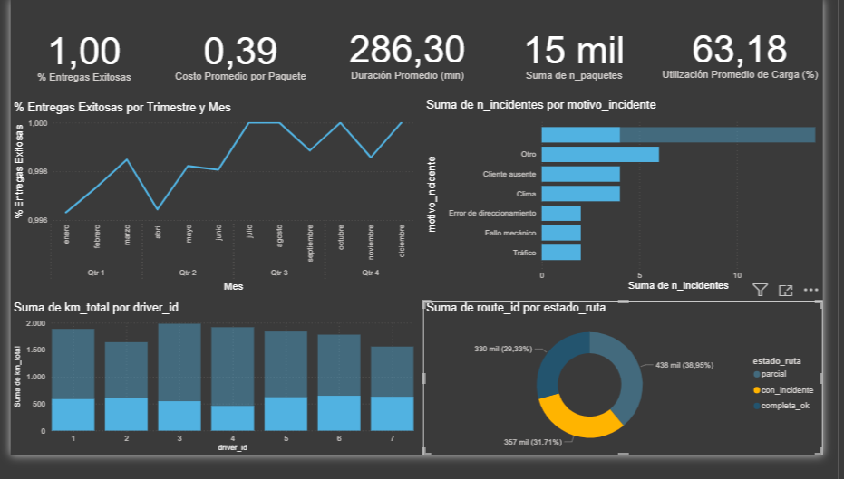

# Logística — Análisis de Rutas (La Plata) 🚚📦

## Resumen
Proyecto de análisis geoespacial y operacional sobre rutas de reparto en el Partido de La Plata. Incluye limpieza de datos, análisis exploratorio, métricas operativas y un dashboard (Power BI) para visualización interactiva.

## Pipeline del proyecto
1. **Ingesta y Limpieza:** normalización de columnas, corrección de tipos y exportación a `rutas_limpias.csv`.
2. **Análisis Exploratorio (EDA):** métricas descriptivas, correlaciones, validación de datos.
3. **Visualización Geoespacial:** representación sobre polígonos de barrios (GeoJSON).
4. **Dashboard Power BI:** consolidación de insights visuales y métricas operativas.


## Contenido del repositorio
- `data/` — datos (raw y procesados).
- `notebooks/` — notebooks reproducibles (ingesta, EDA, visual).
- `src/` — funciones reutilizables.
- `reports/` — imágenes y PDF con hallazgos.
- `powerbi/` — archivo PBIX con dashboard (opcional).

## Objetivos
1. Normalizar y documentar los datos de rutas.
2. Generar métricas clave: duración, km, eficiencia, tasa de fallas.
3. Visualizar cobertura por barrio usando polígonos geoespaciales.
4. Preparar dataset exportable para Power BI y presentación.

## Requisitos (ambiente)
Recomiendo crear un entorno conda (especialmente para geopandas):

```bash
conda env create -f environment.yml
conda activate logistica-analisis

# O si preferís usar pip
pip install -r requirements.txt

## Autor
👨‍💻 **Thomas Gómez**  
Estudiante de Ingeniería en Sistemas – UTN  
Enfocado en desarrollo backend y análisis de datos.  
📫 [LinkedIn](https://www.linkedin.com/in/thomas-gomez-pro) 

## Visualización destacada



